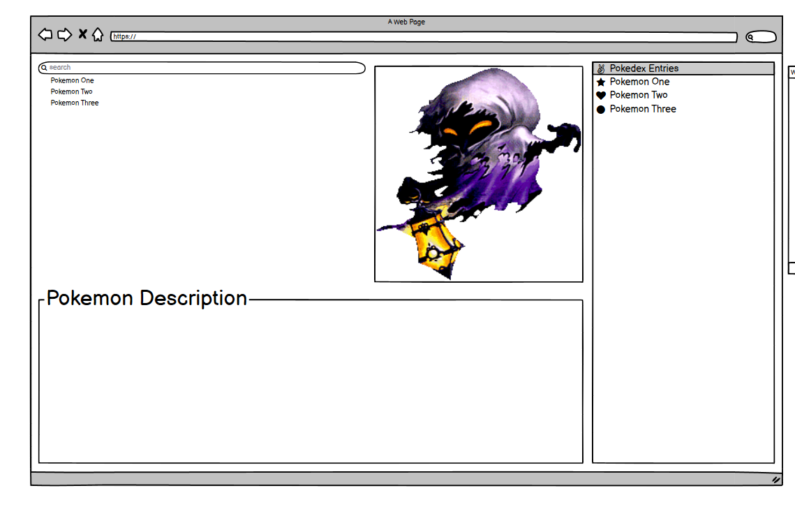

## Pokemon Pokedex(Catalog)

***

<b>Using :</b>

- Balsamiq

- React

- CSS

- Node

- Express
- ?????

- change

***

***

  
<b>Pokedex Mockup :</b>

***
***

  
<b>Pokedex Logo :</b>

***

***

Idea is to create a pokedex that looks aesthetically pleasing and is functional on some level to help keep track of moving pokemon from game to game and bank to home.

This project has a mentor helping, as well as, learning along the way.

>Such as | Soul Silver > Ultra Sun > Pokemon Bank > Sword > Home

***

### **Start of Creating the Front End Design**
- Balsamiq

Using tools to create a mockup of the site.

- HTML

The design is to be a simple and functional pokedex that lets you select and view pokemon. A mockup will be made showing a tentative design for the webpage. So far this mockup has 4 parts to it: Search, Description, Sprite, Entries(List of Pokemon).

- CSS

Input will be pokemon name(with auto-complete) seach, or entry selection.

Output will have descriptions, and sprites. The basic mockup only took a few minutes to design. Based off many other pokedex creations.

I made a logo.

***

***

Start of HTML and CSS prototype. One of the steps required to create a component is to create the styling and divisions before putting it together in React.

First few steps are creating a few boxes and style them into a format of my choosing. The easiest way is using html to create the divs and then make a stylesheet. Adding this to the divs will have the desired design.

***

### HTML
- Search

Display 

- Description

- Sprite

- box???

***

### **Resources for Pokedex**

- https://htmlcheatsheet.com/

- https://htmlcheatsheet.com/css/

- https://pokeapi.co/about

- http://www.htmltemplates.net/

- https://www.w3schools.com/cssref/playdemo.asp?filename=playcss_background-origin

- https://codepen.io/triss90/pen/ZOrYra

- https://www.designpieces.com/palette/pokemon-logo-color-palette-hex-and-rgb/

- https://codepen.io/BrendanGasparin/pen/JjJVwRe

- https://codepen.io/axeldjunior/pen/RwLgOvB

***

  